# Food Truck Locator 🍔🚚

This is a full-stack web application built with Spring Boot (backend) and React (frontend) that allows users to:
- View food trucks near them on a map
- Leave reviews
- Mark favorites
- Get directions using What3Words and Google Maps

---

## 🛠️ Tech Stack

**Frontend**: React, Google Maps API, What3Words, MUI  
**Backend**: Spring Boot, MySQL, JPA (JdbcTemplate)  
**Database**: MySQL  
**Location APIs**: Google Maps + What3Words

---

## ⚙️ Setup Instructions

### 📌 Prerequisites
- Java 17+
- Node.js (18.x recommended)
- MySQL 8+
- Git

---

## 🧑‍🍳 Backend Setup (Spring Boot)

### 1. Clone and Import Project
```bash
git clone https://github.com/your-username/Food-Truck-Locator.git
cd backend
```

### 2. Create MySQL Database
```sql
CREATE DATABASE foodtruck;
USE foodtruck;
```

### 3. Run Initial SQL Script
Run the script `foodtruck.sql` located in the backend folder.
It contains:
- AccountDetails
- FoodTruckInformation
- Reviews
- Default data from Charlotte 🗺️

### 4. Configure Secrets

In `backend/src/main/resources/application.properties`:
```properties
spring.datasource.url=jdbc:mysql://localhost:3306/foodtruck
spring.datasource.username=YOUR_MYSQL_USERNAME
spring.datasource.password=YOUR_MYSQL_PASSWORD
```

---

## 🎨 Frontend Setup (React)

### 1. Open frontend
```bash
cd frontend
```

### 2. Install Dependencies
```bash
npm install
```

### 3. Configure Secrets

In `src/Helper/Helper.js`:
```js
export const url = "http://localhost:8080"; // Backend URL
export const googlemapsapi = "YOUR_GOOGLE_MAPS_API_KEY";
```

In `backend/src/main/java/com/foodTruck/backend/helpers/Secrets.java`:
```java
static final String googleMapsAPIKey = "YOUR_GOOGLE_MAPS_API_KEY";
static final String what3wordsAPI = "YOUR_WHAT3WORDS_API_KEY";
```

#### 🔑 How to get API Keys

- **Google Maps API**: https://console.cloud.google.com/
- **What3Words**: https://developer.what3words.com/public-api

---

### 4. Start Frontend Server
```bash
npm start
```

---

## 🧪 Testing Locally (Simulating Charlotte)

If you're testing food trucks in Charlotte, you can simulate GPS using Chrome DevTools:

1. Open DevTools → 3 Dots → More Tools → Sensors
2. Set location: Preset → “Other…”
3. Input Coordinates:
   ```
   Latitude: 35.2271
   Longitude: -80.8431
   ```

---

## ✅ Features

- 🔍 Search food trucks by proximity
- ❤️ Favorite / unfavorite trucks
- 💬 Review & Rating
- 📍 Google Maps + What3Words integration
- 🧭 Distance-based filtering

---

### 📸 Screenshots

| Screen | Description |
|--------|-------------|
| 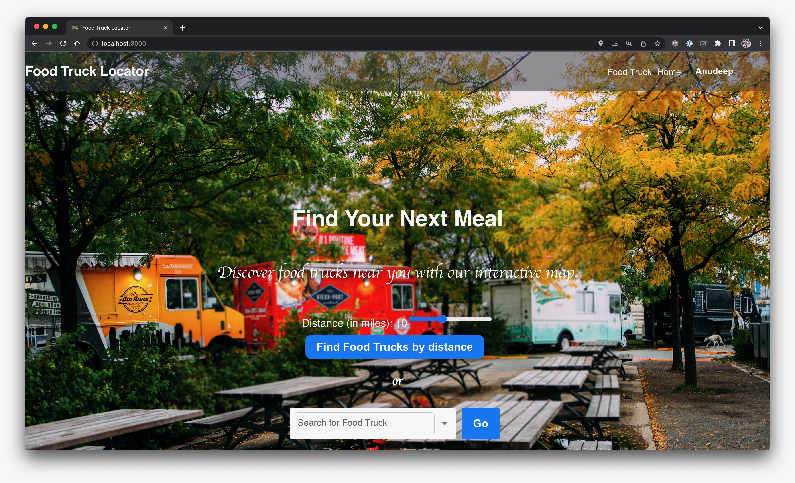 | 🧭 **Landing page** where users can search food trucks by distance or name |
| 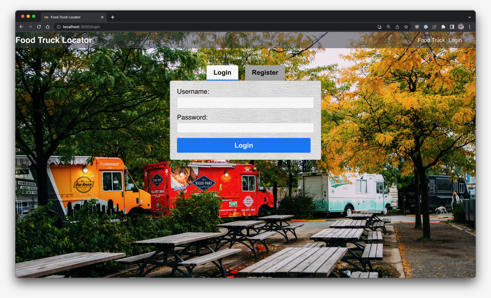 | 🔐 **Login page** for users and admins |
| 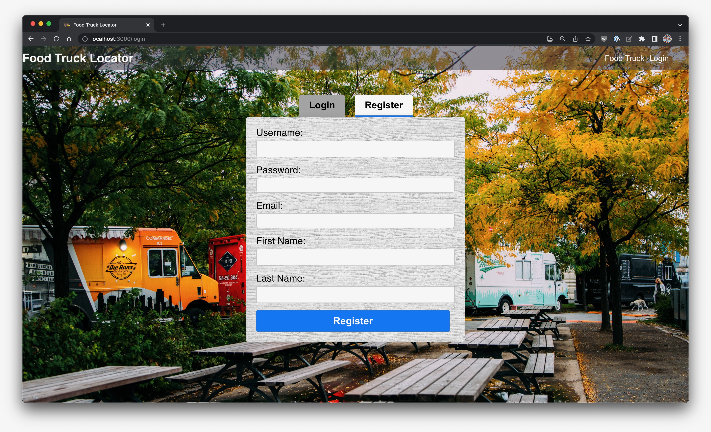 | 📝 **User registration** screen with basic info |
| 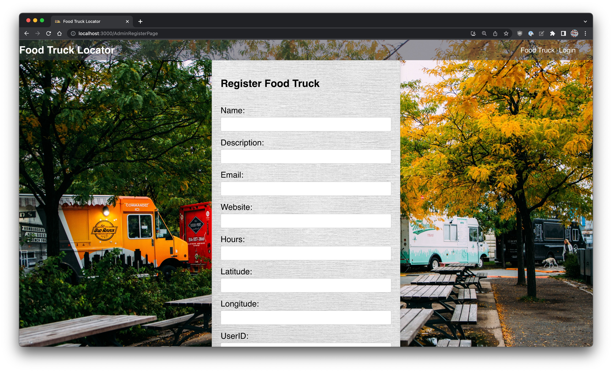 | 🧾 **Admin panel** to register a new food truck |
| 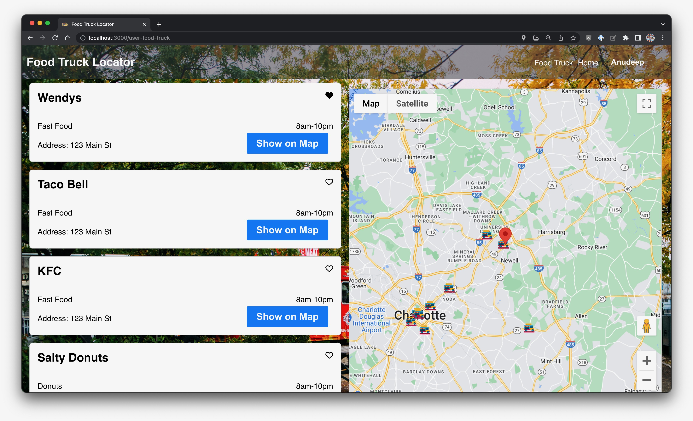 | 🗺️ **User dashboard** with a list of food trucks and Google Map integration |
| 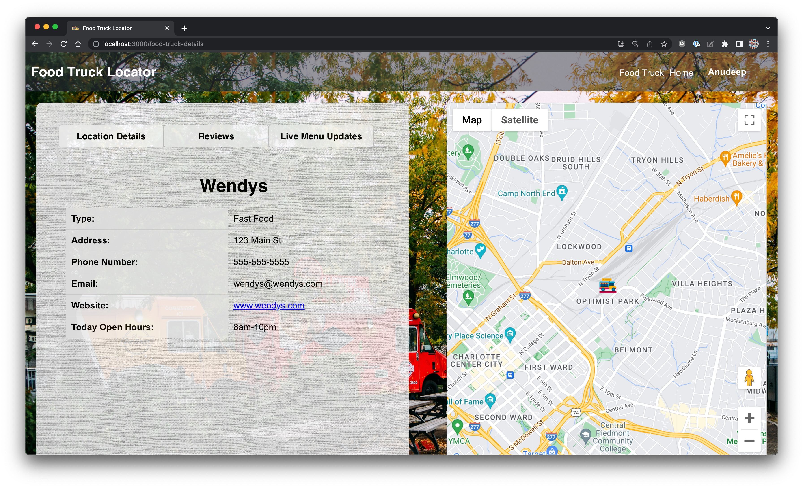 | 📋 **Food truck details** with type, hours, and contact info |
| 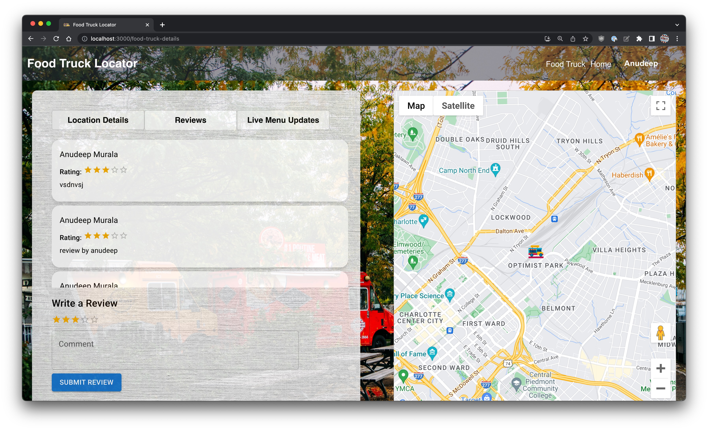 | ⭐ **Review and rating** section for users |
| 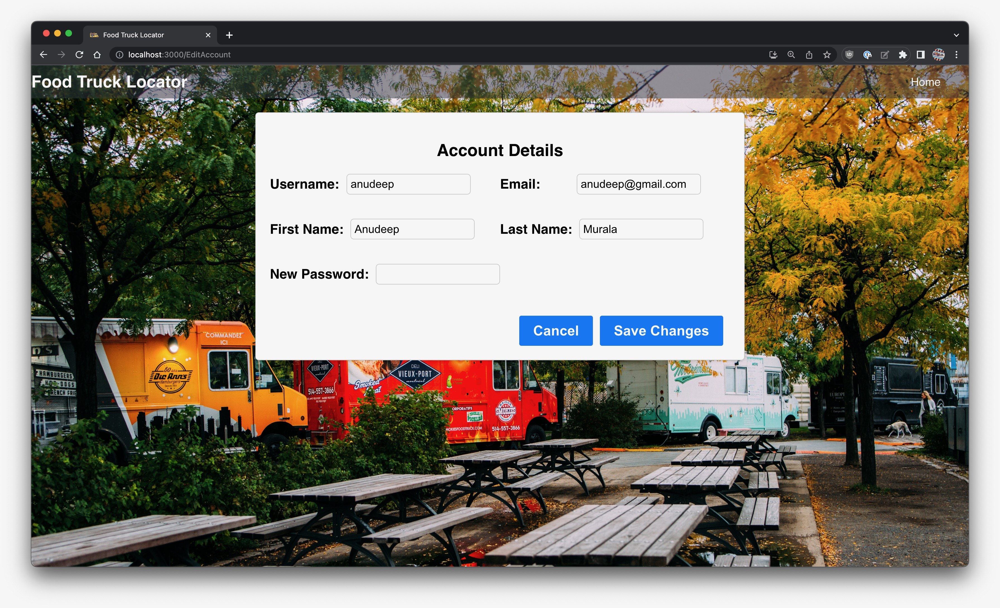 | 🔄 **Account management** screen to update user details |
| 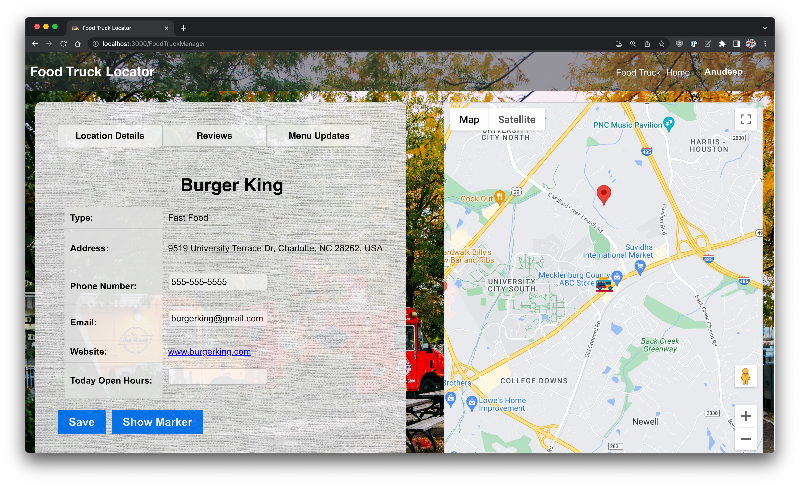 | 📍 **Admin view** to manage truck marker on map |
| 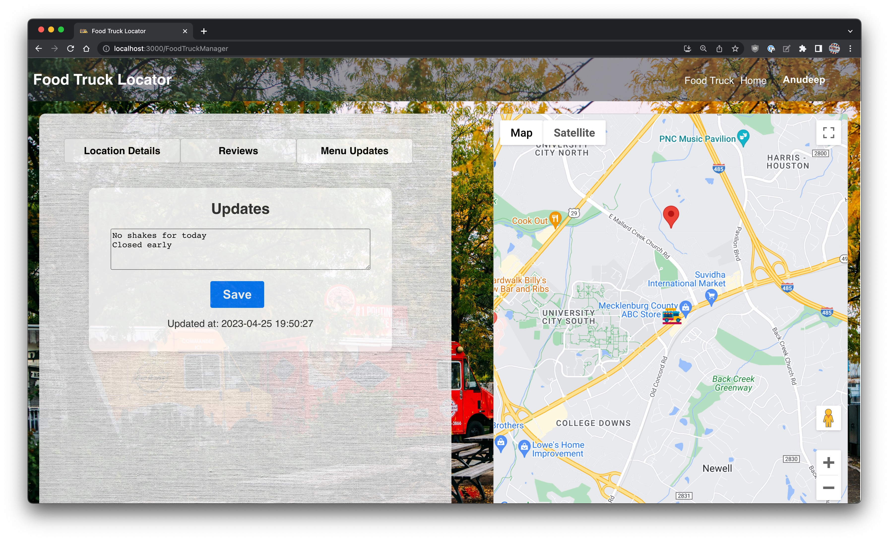 | 🧾 **Live updates** feature for food truck status or menu |
| 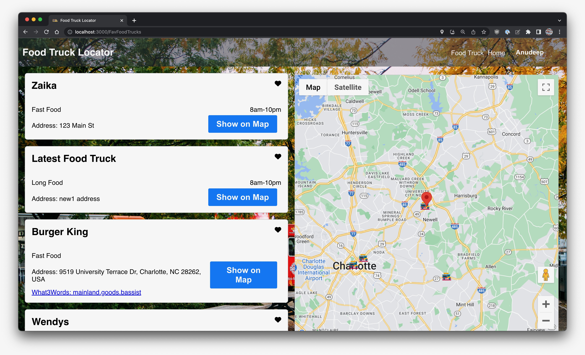 | ❤️ **Favorites page** where users can view and manage their liked food trucks |


---

## 📁 Folder Structure

```
/backend
    └── src/main/java/com/foodTruck/backend/
        └── controller, util, objectClasses
    └── resources/application.properties
    └── foodtruck.sql

/frontend
    └── src/
        └── Pages, Components, Map Integration
        └── Helper/Helper.js
```

---

## 🙋‍♂️ Author
Made by Gaurav Avula – [gauravavula.com](http://gauravavula.com)

## 🪪 License

This project is licensed under the [MIT License](LICENSE).
